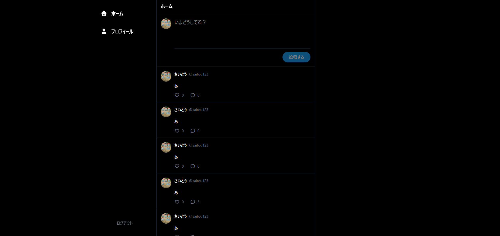
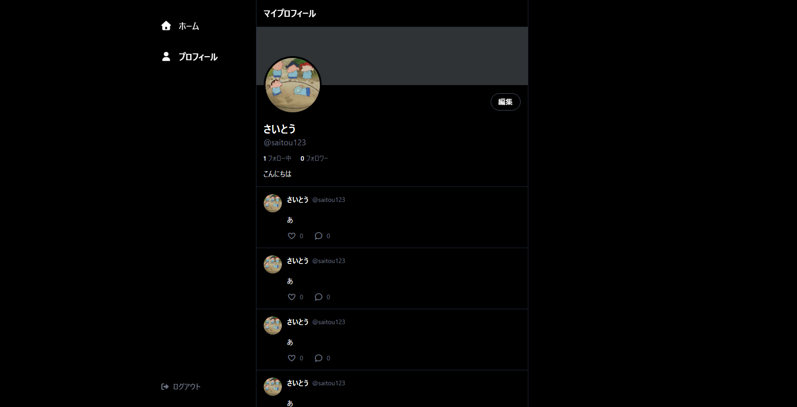
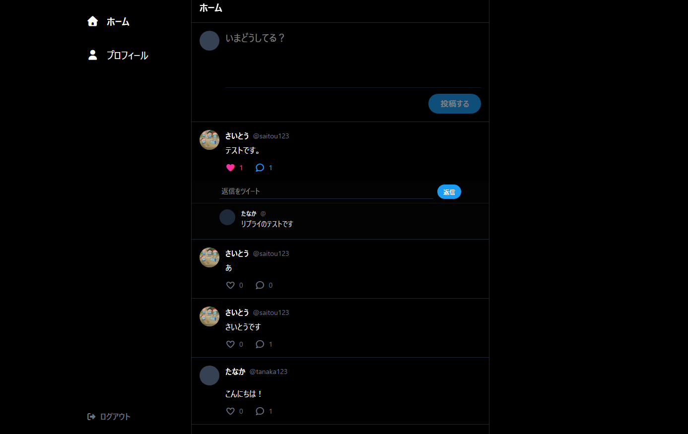
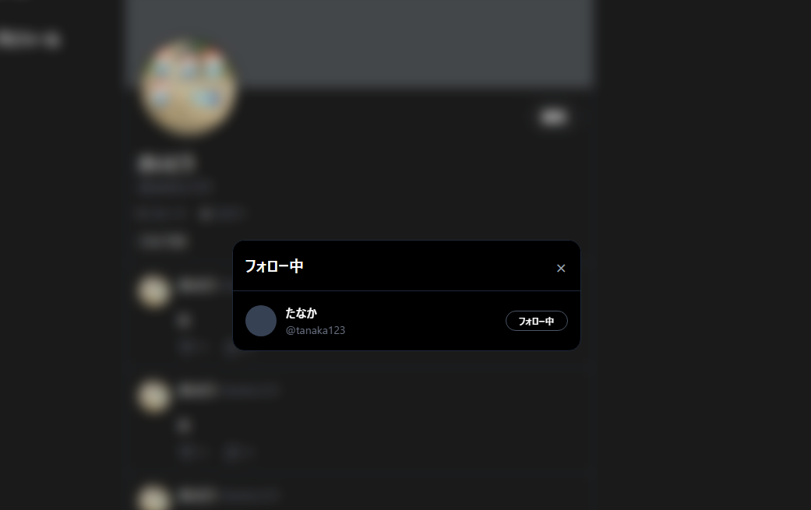
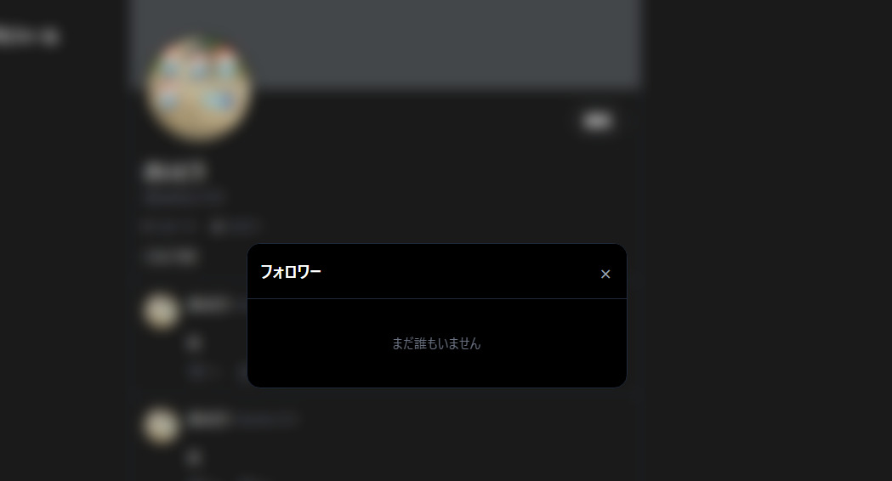

# ミニSNSアプリ

実務を想定したフルスタックWebアプリケーションの学習用プロジェクトです。
Rails 8 (APIモード) と React 19 を組み合わせ、モダンな開発スタックとデータ整合性を重視して構築しています。

## 📸 スクリーンショット
| ホーム画面 | プロフィール画面 |
|---|---|
|  |  |

---

## 🚀 概要
X（旧Twitter）をベースとしたSNSアプリケーションです。
単なるクローン開発にとどまらず自己学習のため、**「最新技術へのキャッチアップ」**と**「保守性の高いデータベース設計」**をテーマに開発。2026年時点の最新メジャーバージョン（Rails 8 / React 19 / Tailwind v4）をいち早く取り入れています。

## 🛠 使用技術 (Versions)

### Backend
- **Ruby 3.3.10 / Ruby on Rails 8.0.4 (APIモード)**
  - 最新の Rails 8 を採用。認証には JWT を使用
- **PostgreSQL 18.1**
  - フォロー・フォロワー等の多対多リレーションを扱うためのリレーショナルDB。
- **RSpec / RuboCop**
  - **GitHub Actions** を活用したCIパイプラインを構築し、コード品質の自動チェック

### Frontend
- **React 19.2.0 (Vite 7.3.1)**
  - React 19 の最新機能を活用。Vite による高速なビルドと、再利用性を意識したコンポーネント設計。
- **TailwindCSS 4.2.1**
- **Axios 1.13.6**
  - Rails APIとの非同期通信の制御。

### AI & Tools
- **Gemini (Google AI)**
  - 実装方針の策定、エラー解決、リファクタリング案の生成など、AIとの協調開発を実践
  - このREADMEもAI等を使用し、視認性を高めています

---

## ✨ 機能一覧
- **認証系**: JWTによるサインアップ、ログイン/ログアウト
- **投稿系**: 投稿作成、一覧表示、投稿削除（関連データの連動削除対応）
- **インタラクション**: 
  - **いいね機能**: 非同期通信によるシームレスなUI更新
  - **コメント（リプライ）機能**: 投稿に紐づく階層的なデータ表示
  - 
- **ユーザー関連**:
  - **フォロー / フォロワー機能**: 自己参照的な中間テーブルを用いた多対多の実装
  - 
  - **プロフィールのカスタマイズ**: Active Storage を利用したアイコン画像のアップロード
  - 

---

## 🏗 アーキテクチャ・ディレクトリ構成
フロントエンドとバックエンドを完全に分離した「APIベース」の構成を採用しています。

```text
.
├── backend  # Ruby on Rails 8 (API Mode)
└── frontend # React 19 (Vite + TailwindCSS v4)
```

---

## 🚢 本番デプロイ準備（Render）

Render などの本番環境では、バックエンド側に以下の環境変数を設定します。

| 変数名 | 用途 |
|---|---|
| `DATABASE_URL` | 本番 PostgreSQL の接続URL。Render PostgreSQL を利用する場合は External Database URL などを設定します。 |
| `SECRET_KEY_BASE` | Rails と devise-jwt の署名用 secret。このアプリでは JWT secret として `config/initializers/devise.rb` で使用しています。 |
| `FRONTEND_ORIGIN` | CORS で許可する本番フロントエンドのオリジン。例: `https://example-frontend.onrender.com` |
| `RAILS_ENV` | `production` を設定します。 |
| `RAILS_MASTER_KEY` | encrypted credentials を本番で参照する場合に必要です。`SECRET_KEY_BASE` を環境変数で設定する運用なら JWT secret 目的では不要です。 |

JWT は `Authorization` ヘッダーで送受信します。CORS では本番の `FRONTEND_ORIGIN` のみを明示的に許可し、レスポンスヘッダーの `Authorization` を公開しています。

ポートフォリオ用途の本番設定では、cache / Active Job / Action Cable は追加DBを必須にしない軽量構成にしています。

### デプロイ前チェック

```bash
bundle exec rspec
bundle exec rubocop
bundle exec brakeman --no-pager
git diff --check
```
