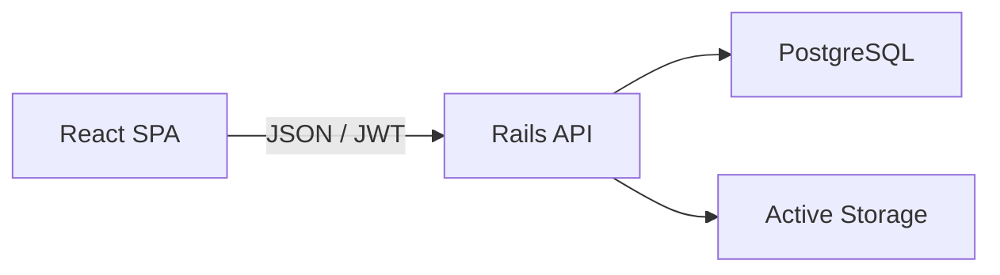
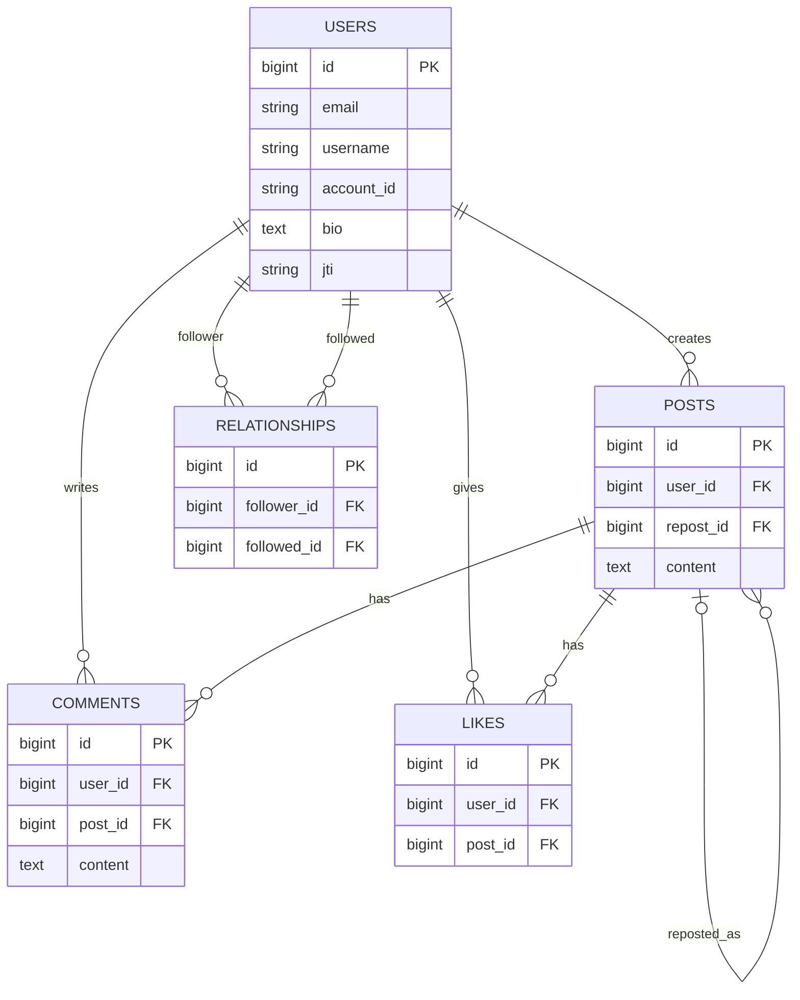

# README改善案

以下は、就職活動向けREADMEとして置き換えるための構成案です。公開URL、リポジトリURL、実際の環境変数名は公開前に調整してください。

---

# Mini SNS

Rails APIとReactで開発した、X風のミニSNSアプリです。

投稿、リプライ、いいね、フォロー、リポスト、プロフィール画像変更を実装しています。機能を作るだけでなく、認証・認可、DB制約、API設計、テスト、CIを通じて、変更に強いWebアプリを作ることを目的に開発しました。

- Demo: `https://...`
- Frontend repository: `https://github.com/...`
- Backend repository: `https://github.com/...`
- Demo account: `portfolio@example.com / ********`

## スクリーンショット

| ホーム | プロフィール |
|---|---|
| `ミニSNSアプリ１.png` | `ミニSNSアプリ２.png` |

| フォロー一覧 | リプライ・いいね |
|---|---|
| `ミニSNSアプリ３.png` | `ミニSNSアプリ５.png` |

完成時はGIFまたは30〜60秒の動画も追加し、以下の流れを一度で見せます。

1. ログイン
2. 投稿
3. いいね・リプライ・リポスト
4. フォロー
5. プロフィール編集

## 作成目的

フロントエンドとバックエンドを分離したWebアプリの開発を通じて、次の内容を実践するために作成しました。

- REST APIの設計
- JWT認証
- ログインユーザー単位の認可
- Reactによる非同期UI
- PostgreSQLによるデータ整合性
- 自動テストとCI
- 画像アップロード

## 使用技術

### Backend

| 技術 | 用途 |
|---|---|
| Ruby 3.3.10 | 言語 |
| Ruby on Rails 8.0.4 | API |
| PostgreSQL | DB |
| Devise / devise-jwt | 認証 |
| Active Storage | 画像 |
| Kaminari | ページネーション |
| RSpec | テスト |
| RuboCop / Brakeman | 静的解析 |

### Frontend

| 技術 | 用途 |
|---|---|
| React 19 | UI |
| Vite | 開発・build |
| Tailwind CSS 4 | styling |
| Axios | API通信 |

### Infrastructure / Tools

- GitHub Actions
- Docker
- Dependabot

## 主な機能

- ユーザー登録、ログイン、ログアウト
- 投稿作成、一覧、削除
- リプライ
- いいね
- フォロー、フォロワー
- リポスト
- プロフィール編集
- アイコン画像アップロード
- ログインユーザーによる操作制御

## システム構成



フロントエンドとバックエンドを分離し、ReactからAxiosでRails APIを呼び出します。認証が必要なAPIにはAuthorization headerでJWTを送信します。

## ER図

不要カラム整理後の完成形を掲載します。



## API設計

代表的なAPIのみ掲載します。

| Method | Endpoint | 認証 | 内容 |
|---|---|---:|---|
| POST | `/users` | - | ユーザー登録 |
| POST | `/users/sign_in` | - | ログイン |
| DELETE | `/users/sign_out` | 必須 | ログアウト |
| GET | `/api/posts` | 必須 | 投稿一覧 |
| POST | `/api/posts` | 必須 | 投稿・リポスト作成 |
| DELETE | `/api/posts/:id` | 必須 | 自分の投稿を削除 |
| POST | `/api/posts/:post_id/like` | 必須 | いいね |
| DELETE | `/api/posts/:post_id/like` | 必須 | いいね解除 |
| POST | `/api/posts/:post_id/comments` | 必須 | リプライ |
| DELETE | `/api/comments/:id` | 必須 | 自分のリプライを削除 |
| PUT | `/api/profile` | 必須 | 自分のプロフィール更新 |
| POST | `/api/relationships` | 必須 | フォロー |
| DELETE | `/api/relationships/:user_id` | 必須 | フォロー解除 |

APIレスポンス例:

```json
{
  "data": [
    {
      "id": 1,
      "content": "初めての投稿です",
      "createdAt": "2026-06-23T12:00:00Z",
      "likesCount": 2,
      "isLikedByMe": true,
      "user": {
        "id": 1,
        "username": "Portfolio User",
        "accountId": "portfolio_user"
      }
    }
  ],
  "meta": {
    "currentPage": 1,
    "totalPages": 3
  }
}
```

## 工夫した点

### API側で所有権を検証

削除対象を単純な`Post.find(params[:id])`ではなく、`current_user.posts.find(params[:id])`から取得しています。画面上でボタンを隠すだけでなく、APIを直接呼ばれても他人の投稿を削除できないようにしています。

### SNSの関連をDBで表現

フォロー機能はUser同士の自己参照多対多、リポストはPostの自己参照として表現しました。重複いいね・重複フォロー・重複リポストは、validationだけでなくDBのunique indexでも防ぎます。

### フロントとAPIの責務を分離

Reactは表示と操作、Railsは認証・認可・validation・永続化を担当します。フロントの状態だけを信用せず、データを変更するAPIは必ずサーバー側でも検証します。

### 品質チェックの自動化

GitHub ActionsでRSpec、RuboCop、Brakeman、frontend lint/buildを実行し、変更による不具合やコード品質低下を検出します。

## 苦労した点

### JWT認証

ログイン時のtoken発行、Authorization headerへの付与、ログアウト時の失効を一貫させる点に苦労しました。最終的にはAPI clientへ認証処理を集約し、401時の処理も共通化しました。

### フォロー機能

User同士の自己参照関連と、フォローする側・される側の命名に苦労しました。`follower`と`followed`を中間テーブルで明示し、モデルテストとrequest specで重複・自己フォロー・解除を確認しました。

### N+1

一覧画面では投稿だけでなく、ユーザー、いいね、コメント、リポストを表示するため、serializerから関連を参照するとN+1が発生しました。必要な関連のpreloadと、一覧APIで返す情報の見直しによって改善しました。

## セキュリティ面で意識した点

- 変更系APIへの認証
- `current_user`を基準にした所有権確認
- Strong Parameters
- JWTの有効期限とログアウト時の失効
- CORS originの限定
- パスワード、tokenのログフィルタ
- 画像のMIME typeとサイズ制限
- DB unique indexによる競合時の重複防止
- BrakemanとDependabotによる継続確認

## テスト

```bash
# Backend
bundle exec rspec
bundle exec rubocop
bundle exec brakeman --no-pager

# Frontend
npm run lint
npm run build
```

重点的にテストしている内容:

- 未ログインユーザーの変更操作を拒否
- 他人の投稿・コメントを変更できない
- 重複いいね、重複フォローを拒否
- ログアウト後のtokenを拒否
- validation errorのJSON形式

## ローカル環境構築

### 必要環境

- Ruby 3.3.10
- Node.js
- PostgreSQL

### Backend

```bash
git clone <backend-url>
cd backend
bundle install
cp .env.example .env
bin/rails db:prepare
bin/rails db:seed
bin/rails server
```

### Frontend

```bash
git clone <frontend-url>
cd frontend
npm install
cp .env.example .env
npm run dev
```

環境変数例:

```dotenv
# backend
DB_USERNAME=
DB_PASSWORD=
DB_HOST=localhost
ALLOWED_ORIGINS=http://localhost:5173

# frontend
VITE_API_BASE_URL=http://localhost:3000
```

秘密情報はコミットしません。

## 今後の改善

- TypeScriptの段階導入
- 無限スクロール
- 通知
- 画像ストレージのS3対応
- E2Eテスト
- アクセシビリティ改善

## 開発を通して学んだこと

最初は機能を動かすことを優先しましたが、機能が増えるにつれて、APIレスポンスの統一、DB制約、テスト、コンポーネント分割の重要性を実感しました。

このアプリでは、問題を見つけた後にrequest specで現在の挙動を固定し、小さな単位でリファクタリングする方針へ改善しました。単に実装するだけでなく、既存機能を守りながら設計を改善する経験を得られた点が、最も大きな学びです。

---

## README掲載時の注意

- 「最新技術だから採用した」だけでなく、採用理由とトレードオフを書く
- AI利用は補助として透明性を持って書き、自分が設計・検証・説明できることを示す
- 未実装の内容を完了形として書かない
- バージョン番号はリポジトリのlock fileと一致させる
- 公開URL、CI badge、テスト結果をREADME上部に置く
- スクリーンショットのデータを自然な内容へ差し替える
